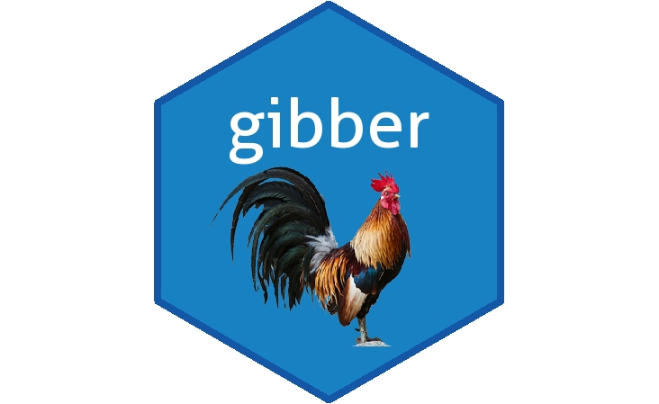

<!-- README.md is generated from README.Rmd. Please edit that file -->

```{r, include = FALSE}
knitr::opts_chunk$set(
  collapse = TRUE,
  comment = "#>",
  fig.path = "man/figures/README-",
  out.width = "100%"
)
```

# gibber 

```{r, echo = FALSE, results='asis'}
cat(
	badger::badge_devel("Glender/gibber", "purple"),
	badger::badge_github_actions("rossellhayes/ipa"),
	badger::badge_codecov("rcannood/princurve"),
	badger::badge_code_size("Glender/gibber")
)
```

## Overview

When collecting qualitative survey data, not every respondent is motivated to provide valid answers to survey questions.
Respondents may get bored answering repetitive questions or are driven to finish questionnaires as soon as possible because of survey rewards. The gibber packages tries to identify those respondents by examining their textual answers on open questions. A deep learning algorithm is used for this purpose and yields the probability that text is real. For example, answers like 'asdf' and 'dghfr' are considered gibberish, while answers like 'computer' and 'trunk' are classified as legit text.     

## :writing_hand: Author

Name: Glenn Hiemstra

Email: Glenn.Hiemstra@gmail.com

## :arrow_double_down: Installation

```r
# this package has a dependency on keras
# Be warned: it can be quite painfull to install keras on windows and mac
# install.packages("keras") # package version 2.6.0
# library(keras)

# then install tensorflow backend for gpu or cpu:
# install_keras() # for cpu
# install_keras(tensorflow = "gpu")

# Thereafter, install the development version from GitHub:
# install.packages("devtools")
devtools::install_github("Glender/gibber")
```

## :book: Usage

```{r}
library(gibber)

# create vector with character data
text <- c(
 "Personally I'm always ready to learn, although I do not always like being taught.",
 "asdfg",
 "Computer",
 "dfhdfghd",
 "I love to walk.",
 "dhdshergeregfrvgergsgr"
)

# assess if text is legit, on default output gives a probability
# the higher the prob, the more likely text is gibberish
is_gibber(text)

# change output to logical
is_gibber(text, output = "bool")

```

## :floppy_disk: Data

`is_gibber` assesses the probability that a sentence contains gibberish words. For each word in a sentence, the model inspects the sequence of vowels and consonents to estimate whether a sentence consists of natural words. Therefore, words like 'asdfg' and 'dfrgfh' are considered unnatural and are classified as gibber.

For this goal, a recurrent neural network was trained on a dataset that contains 700.000 English words (50% gibberish words/50% natural words). Special care was taken to avoid overfitting and an accuracy of 97% was achieved on a validation dataset, thereby guaranteeing generalizable results.

## :speech_balloon: Help

The documentation of all functions can be accessed by `?<function-name>` or navigate via the package documentation help page `?gibber` or `help("gibber")`.
```
# For example:
?is_gibber
help("is_gibber")
```


